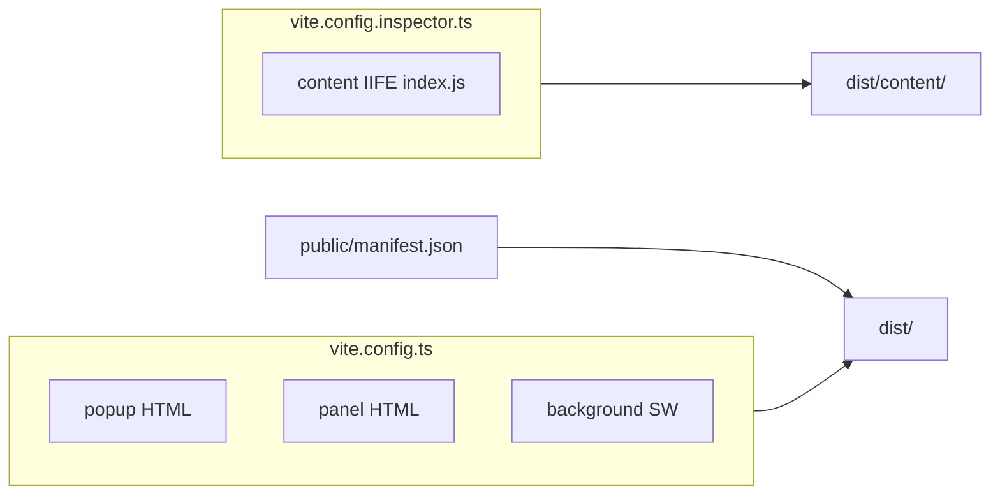

# Monday.com Inspector — project overview

Single reference for repository layout, builds, runtime pieces, and optional follow-up work.

## Identity and purpose

- **Package:** root `package.json` — `monday-inspector` (see `version` field).
- **Extension name:** Monday.com Inspector (`public/manifest.json`).
- **Purpose:** Board schema, hierarchy, detail view, raw GraphQL query editor, import/export, bulk actions; file-based parent/subitem import flows. The **embedded Inspector** (Shadow DOM on board pages) is the primary UI. A separate **panel** app (`src/panel/`) is built for a standalone import wizard and is mainly used via the Vite dev server (`server.open`).

## Technology stack

- **React 18** + **TypeScript** + **Vite 5**
- **Tailwind CSS** + **Radix Slot** + **lucide-react** + **CVA / clsx / tailwind-merge**
- **PapaParse** (CSV), **xlsx** (Excel; Monday export handling including ZIP64-related handling in `src/services/fileParser.ts`)
- **Chrome MV3:** `storage`, `activeTab`; `host_permissions`: `https://*.monday.com/*`

## Builds and outputs

- `npm run build`: `tsc` + main Vite build + second build (`vite.config.inspector.ts`). The content script is emitted as `dist/content/index.js`. The main Vite config’s `copyContentCss` plugin copies `src/content/inject.css` into `dist/content/inject.css`.
- **Path alias:** `@` → `src/`

## Runtime components

| Piece | Source | Role |
|--------|--------|------|
| Background service worker | `src/background/index.ts` | Extension action badge styling (`setBadgeBackgroundColor`). |
| Content script | `src/content/index.ts` | On `/boards/{id}` URLs, injects an “Inspector” control; mounts `Inspector` in Shadow DOM with inlined CSS; handles `GET_STATUS` / `TOGGLE_PANEL` for the popup. |
| Popup | `src/popup/Popup.tsx` | Detects Monday board tab; toggles inline inspector; token card. |
| Panel (full-page UI) | `src/panel/Panel.tsx` | Token, board ID, file upload, column mapping, import progress — **not** registered in `manifest.json` as `side_panel` or a dedicated tab URL; dev server opens this page for convenience. |
| Embedded Inspector | `src/inspector/*` | Board data: `useBoard` → `inspectorApi` → `mondayApi`; tabs: schema, hierarchy, detail, query, import, actions, logs. |

## Inspector tabs and state

- `src/inspector/Inspector.tsx`: tabs `schema`, `hierarchy`, `detail`, `query`, `import`, `actions`, `logs`.
- Token: `chrome.storage.local` key `monday_api_token` (`STORAGE_KEY_TOKEN` in `src/utils/constants.ts`); gate UI in `TokenSetup`.
- Shared UI state: `useInspectorStore`.
- Supporting UI: `ExportMenu`, `ComplexityBadge`, etc.

## API and data layer

- **Endpoint:** `MONDAY_API_URL` in `src/utils/constants.ts` → `https://api.monday.com/v2`, with header `API-Version: 2024-10` on requests in `mondayApi.ts`.
- **Core client:** `src/services/mondayApi.ts` — GraphQL helper, `executeRawQuery`, board/subitem operations, import batching (`BATCH_SIZE`, delays, retries), `RateLimitError`.
- **Inspector wrapper:** `src/inspector/services/inspectorApi.ts` — logging and complexity integration with `complexityStore`.
- **Storage helpers:** `src/utils/storage.ts` — `chrome.storage.local` with dev `localStorage` fallback; content script sets `current_board_id` where applicable.

## Shared UI and types

- Shared components: `src/components/*`
- Primitives: `src/components/ui/*`
- Types: `src/utils/types.ts`

## Static site

- `docs/` — marketing and guides (index, privacy, import guides).
- `landing/` — landing + privacy.
- `tools/generate-icons.html` — icon generation helper.

## Maintenance note

- `src/services/mondayApi.ts` is large (1000+ lines). Prefer **new** logic in smaller modules (see deep dive below) rather than growing this file further.

## Optional: `.claude/launch.json`

Not present in this repository. If you maintain a local multi-project setup, keep IDE launch config separate from the extension sources.

---

## Deep dive backlog (optional tasks)

The following is an implementation-oriented plan for two improvements: splitting `mondayApi.ts` and wiring the standalone panel into the extension manifest if product requirements call for it.

### 1. Splitting `mondayApi.ts`

**Goal:** Move code out of the monolithic file while keeping a **stable import surface** for the rest of the app (either retain `mondayApi.ts` as a thin re-export barrel or update all imports once — barrel is lower risk).

**Suggested modules (under `src/services/monday/` or flat `src/services/`):**

| Module | Contents (illustrative) |
|--------|-------------------------|
| `mondayClient.ts` | `gql`, `RateLimitError`, `sleep`, `executeRawQuery`, shared `fetch` + headers |
| `mondayUsers.ts` | `clearUsersCache`, `getWorkspaceUsers`, `resolvePersonByNameOrEmail` |
| `mondayColumnValues.ts` | `formatColumnValueForApi` and private helpers (`isCheckedValue`, `resolveStatusLabel`, `parseTimelineValue`, `parseToYYYYMMDD`, etc.) |
| `mondayBoardRead.ts` | `verifyToken`, column/group/item fetch helpers, `fetchSubitemBoardId`, `fetchBoardName`, `fetchBoardItemsWithColumns`, `fetchSubitems` |
| `mondayItemsWrite.ts` | `createItem`, `createSubitem`, `deleteItem`, `changeColumnValue` |
| `mondayImport.ts` | `runImport`, `runMondayExportImport`, `runFullMondayExportImport` |

**Steps:**

1. Extract in **dependency order** (client → users/columns → reads → writes → import) to avoid circular imports.
2. Keep types importing from `../utils/types` (or `@/utils/types`).
3. Export everything needed from `mondayApi.ts` via `export { ... } from "./monday/..."` so `inspectorApi` and panel code need no wide refactors on day one.
4. Run `npm run build` and smoke-test: token verify, board load, one import path, query tab raw query.

**Risks:** Accidental duplicate `gql` or diverging headers; mitigate with a single client module only.

### 2. Panel and `manifest.json`

**Today:** `vite.config.ts` includes `panel` as an HTML entry; output lives under `dist/` with hashed asset names. `manifest.json` does not declare a `side_panel` or a dedicated `chrome-extension://` page for this UI. The popup copy refers to an “inspector panel” in the sense of the **inline** Shadow DOM UI, not this HTML entry.

**If you want the standalone panel inside the packaged extension:**

1. **Stable URL:** Ensure the built panel has a predictable path (e.g. `panel.html` at `dist/` root via `rollupOptions.output.entryFileNames` / `assetFileNames` for that input only, or a post-build rename step).
2. **Manifest:** Add the page where Chrome expects it, for example:
   - **`side_panel`** (Chrome Side Panel API): `default_path` pointing at the panel HTML; may require `sidePanel` permission and background/popup wiring to `chrome.sidePanel.open()`.
   - **Or** open a **full tab** to `chrome.runtime.getURL("panel.html")` from the popup when the user chooses “Open import wizard”.
3. **CSP / permissions:** Panel only needs what it already uses (`storage`, Monday hosts if it calls the API from the page — same as inspector).
4. **Board context:** The standalone panel may not have `boardId` from the tab URL; persist `current_board_id` from the content script or ask the user (already partially supported in panel UI).

**Product choice:** Inline Inspector vs side panel vs tabbed panel changes UX; align manifest work with that decision.

---

*Last aligned with repository layout as of branch `cursor/project-overview-and-knowledge-acquisition-f66a`.*
